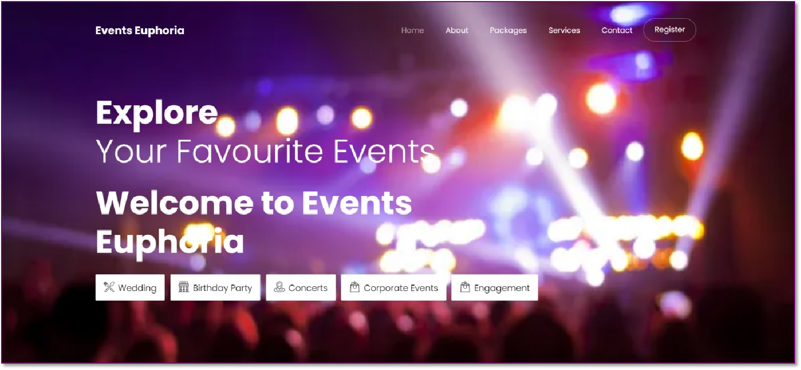

# Event Euphoria - A Event Management Website

## Table of Contents

1. [Introduction](#introduction)
2. [Features](#features)
3. [Installation](#installation)
4. [Technologies Used](#technologies-used)
5. [Contributors](#contributors)
6. [Terms of Use](#terms-of-use)
7. [Support](#support)

## Introduction

Welcome to Event Euphoria, a cutting-edge event management website that transcends traditional platforms by addressing language barriers and providing a comprehensive space for users, event planners, and freelancers. This web application is designed to streamline event planning, booking, and promotion while offering a unique language translator feature.

## Features

### 1. Event Registration
Easily register and customize events with our user-friendly interface. Input event details, dates, locations, and choose from various categories. Set up different ticket types and manage event capacity effortlessly.

### 2. Event Calendar and Scheduling
Plan and schedule events with our integrated calendar system. Manage dates, times, and venues seamlessly. Keep track of upcoming events and avoid scheduling conflicts.

### 3. Event Promotion and Marketing
Promote your events efficiently through our built-in marketing tools. Share on social media, create promotional codes, and use email campaigns to reach a wider audience. Monitor marketing efforts through our analytics dashboard.

### 4. Partnership
Event Euphoria supports freelancers and acts as an advertising platform. Collaborate with photographers, caterers, and other freelancers. This platform promotes both the website owner's business and provides opportunities for freelancers to earn commissions.

### 5. No Language Barrier
Our standout feature is the language translator, eliminating language constraints. Users can translate the entire website into their preferred language with a single click, making Event Euphoria accessible to a global audience.

## Installation

To get started with Event Euphoria, follow these steps:

1. Clone the repository to your local machine.
2. Install the required dependencies using `npm install`.
3. Configure your database settings in the `config.js` file.
4. Run the application with `npm start`.
5. Access the application through your web browser at `http://localhost:3000`.

## Technologies Used

- Node.js
- Express.js
- NeDB
- HTML/CSS
- JavaScript
- Bootstrap

## Contributors

Our project's success is a testament to the power of teamwork and collaboration. Each member of our team brought unique skills, knowledge, and enthusiasm to the table, contributing to the project's development in diverse ways.
Here are our group members:

1. [Mangesh Pangam](https://github.com/Mangesh2704)

2. [Rakshita Sarap](https://github.com/RakshitaSarap)

3. [Saish Rane](https://github.com/saishrane-11)

## Terms of Use

Events Euphoria is open-source website based on event management developed with the help of HTML, CSS and JavaScript.
You can edit and modify!

## Support

We hope you enjoy your experience with Events Euphoria! If you encounter any issues or have suggestions, please feel free to raise them in the Issues section of this repository. Happy Booking! 🎊🤩

Thank you for choosing Event Euphoria for your event management needs! We hope your events are a tremendous success.

## Live Demo

[Events_Euphoria](./public/index.html)
